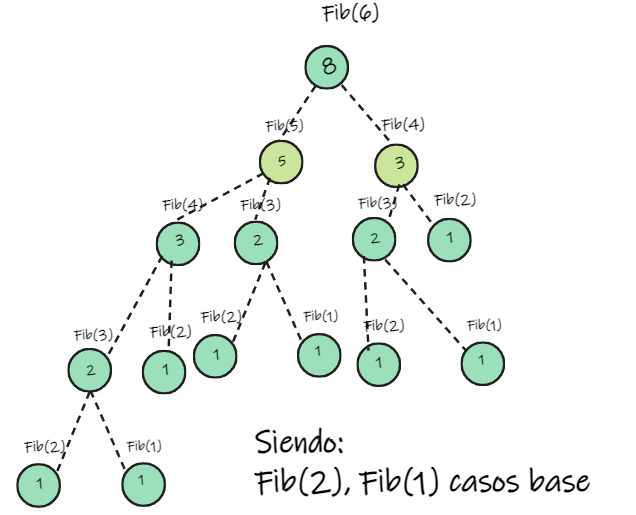

<h1 align="center">Dynamic Programming</h1>
<div>

<p align="justify">
  <h3>Introduction</h3>
  Dynamic Programming is a paradigm focused in recurrent relations. There is an important amount of problems that can be solved using this paradigm, so it's important to pay attention this section.
</p>

<p align="center"><b>It is important to take into account that DP stands for<i>dynamic programming</i>.</b></p>
  
  <br>
  In a general way, there are to approaches to DP:
    <ul>
      <li>Top down (based directly in backtracking).</li>
      <li>Bottom up (tabulation technique).</li>
    </ul>
  
  <h3 align="center">In this case the approach we will take will be <b><i>Bottom up</i></b>, because it is the pure way of DP, so to speak.</h3>
  <hr>
  <h3>Concept</h3>
  It is known as a technique based on a recurrence formula of some states. The solution is obtained using previous sub-problems solutions.
  <br><br>
  First and foremost, a sub-problem is entitled to be a state, a way to describe a situation in which it will be the problem solution, so if we want to find the solution for the 'i' state we need to find first sub-solutions to previous problems. This is done by breaking down the original problem into sub-problems, so the next solution will be built using sub-problems solutions. 

  <h3 align="center">Summarized</h3>
  <h3 align="center"><b><i>sub-solution +…+ sub-solution = Solution</i></b></h3>
  
  
  The key is the problem states identification to decide the relation between the current problem and it's sub-problems. This way, we can build a solution from previous solutions.
  
  <h2 align="center">Bottom-Up DP</h2>
  <h3 align="center">Tabulation Method</h3>
  
  This is the pure form of DP, it is built by a table (matrix or array).
  
  The first step is to break down the original problem into small problems so we are able to solve them first. However, it is important to know that we need a base solution that works so we are able to solve the next sub-problems, this is known as <b>base cases</b>
  
  <h3 align="center">Base Cases</h3>
  These are solutions to one or many sub-problems, so is known those solutions are always the same and will never change. This is why the base cases are the solution to the first state that stands out of the problem. 
  
  <h3 align="left">Example</h3>
  <i>Given a list of N coins find the minimum number of coins of coins the sum of which is S (target number). You can use as many coins of type as we want.</i>
  <br><br>
  
  <p align="justify">
  Breaking down the original problem into smaller problems makes it easy to notice the states are to to make sums with the coins so to make the asked sum. 
  The base case, meaning the solution to a state that we know and will not change, is the necessary amount of coins to structure a sum of 0, so to sum 0 we need 0 coins, with this information we are good to advance to the next sub-problem: to sum 1.
  This way we will find a solution to the next states and fill the table.</p>
  
  <h3 align="left">Steps for making a solution</h3>
  Summarized, we can list the following three steps for making a solution.
  <ol>
      <li>Establish the parameters to describe a situation.</li>
      <li>If we had N parameters we would use N-Dimensional array (DP array) with an entry for each situation.</li>
      <li>Initialize the table with the base cases to get a solution for the next sub-problems, this process will happen until the table is filled with loops (for, while)</li>
  </ol>
  
  <h2 align="center">Example - Fibonacci</h2>
  <h3 align="left">Problem statement</h3>
  <i>Given a number (ith position), find ith Fibonacci number</i>
  
  <h3 align="left">Interpretation</h3>
  Given a number 'i' we use this number like a position. The Output is the 'ith' Fibonacci number.
  
  <h3 align="left">Identify states</h3>
  The sequence follows the rule that each number is equal to the sum of the preceding two numbers. The <b>states</b> are generate this number until to target. 
  
  <h3 align="left">Identify steps for making a solution</h3>
  <ol>
      <li>Parameters: here we have a unique parameter, so we need a 1D array.</li>
      <li>Case base: in this case we know the value for the positions (index): 0, 1, 2. The sequence begins with the following 3 integers: 0, 1, 1. </li>
      <li>Initialize DP array: We can initialize the DP array with this 3 integers and find the next solution.</li>
  </ol>
  
  <h2 align="left">Example - Fibonacci</h2>
  <h3 align="center">For Example: calculate fib(6)</h3><br>
  <p align="center"></p><br> <br>
  
  <h3 align="center">Table filling process<br>
</div>


<div align="center">


 | INDEX |  0  |  1  |  2  |  3  |  4  |  5  |  6  |
|---|---|---|---|---|---|---|---|
|  VALUE |  0  |  1  |  --  |  --  |  --  |  --  |  --  |
  
  <br>Cell_2 = dp(1) + dp (0) =>>  Cell_3 = 0 + 1 =>> Cell_2 = 1<br>
  
| INDEX |  0  |  1  |  2  |  3  |  4  |  5  |  6  |
|---|---|---|---|---|---|---|---|
|  VALUE |  0  |  1  |  1  |  --  |  --  |  --  |  --  |
  
  <br>Cell_3 = dp(2) + dp (1) =>>  Cell_3 = 1 + 1 =>> Cell_3 = 2<<br>
  
  
| INDEX |  0  |  1  |  2  |  3  |  4  |  5  |  6  |
|---|---|---|---|---|---|---|---|
|  VALUE |  0  |  1  |  1  |  2  |  --  |  --  |  --  |
  
  <br>Cell_4 = dp(3) + dp (2) =>>  Cell_3 = 2 + 1 =>> Cell_4 = 3br>
  
| INDEX |  0  |  1  |  2  |  3  |  4  |  5  |  6  |
|---|---|---|---|---|---|---|---|
|  VALUE |  0  |  1  |  1  |  2  |  3  |  --  |  --  |
  
  <br>Cell_5 = dp(4) + dp (3) =>>  Cell_3 = 3 + 2 =>> Cell_5 = 5<br>
  
| INDEX |  0  |  1  |  2  |  3  |  4  |  5  |  6  |
|---|---|---|---|---|---|---|---|
|  VALUE |  0  |  1  |  1  |  2  |  3  |  5  |  --  |
  
  <br>Cell_6 = dp(5) + dp (4) =>>  Cell_3 = 5 + 3 =>> Cell_6 = 8<br>
  
| INDEX |  0  |  1  |  2  |  3  |  4  |  5  |  6  |
|---|---|---|---|---|---|---|---|
|  VALUE |  0  |  1  |  1  |  2  |  3  |  5  |  8  |
  
<br><br>

  <h3 align="center">We can find a recurrence relation formula for calculate the next position.<br><br>dp[n] = dp(n-1) + dp(n-2)  
    <br><br>We need to use a array of size n. <br><br><br>That's why the Space complexity and Time complexity is linear.
    
  <br><br>
  Time complexity = O(n) <hr> Space complexity = O(n) </h3>
  
  <br><br><br><br>
  <h2 align="center">Source Code for Fibonacci series</h2>
  
</div>


```c++
#include<bits/stdc++.h>
using namespace std;

int main()
	{
		long long n; cin>>n;		 // User input
		vector<long long> dp(n+1); // Size of vector	
		
		// Base case
		dp[0] = 0;
		dp[1] = 1;
		
		// DP
		for(int i=2;i<=n;i++)
			{
				dp[i] = dp[i-1] + dp[i-2];
			}
		
		cout<<dp[n];    // ans
	}
```
